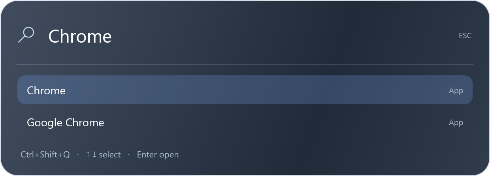

# desktop_widget

A customizable Windows desktop widget suite built with **Windows PowerShell 5.1 and WPF**. No Python, Node.js, browser extension, paid app, or administrator installation is required to run it.

## Features

- **Ctrl+Shift+Q app search**: a centered launcher for installed apps and Start Menu/Desktop shortcuts. Type a name, use Up/Down to select, and press Enter to launch. Escape, a second hotkey press, or clicking outside dismisses it.
- Glass-style top menu bar with Wi-Fi, Bluetooth, sound, battery, calendar and Control Center panels.
- Bottom app dock with running indicators, grouped windows, a hover window picker and access to the Windows system tray.
- Desktop clock, calendar, battery, weather, photo frame, quick notes, folders and a system monitor.
- Media playback controls and a small animated desktop companion.
- Local customization: themes, colors, sizes, positions, visibility and motion settings.



## Quick start

1. Download this repository using **Code > Download ZIP**, then extract it to a permanent folder you can write to, such as `Documents\desktop_widget`.
2. Double-click **Start Widget.cmd**. The widgets run in the background; starting twice does not create duplicates.
3. Right-click a widget and select **Customize widgets...**, or double-click **Customize Widgets.vbs**.
4. Press **Ctrl+Shift+Q** to search your apps.
5. Double-click **Stop Widget.cmd** to exit. The Windows taskbar is restored if you chose to hide it.

The `.cmd` launcher works even if Windows Script Host/VBScript is unavailable. The existing **Start Widget.vbs** launcher is also provided for silent startup.

### Requirements

- Windows 11 recommended, with built-in **Windows PowerShell 5.1**, .NET Framework and WPF. Windows 10 may work, but its glass effects differ. This is not a cross-platform app and does not use PowerShell 7 for its runtime.
- An interactive, unlocked desktop. Some tests need a real desktop, audio device or Wi-Fi adapter.
- Internet is used only for the optional weather request. App search and the other local widgets work offline.

If double-clicking does not work, run this **from the extracted folder**:

```powershell
powershell.exe -NoProfile -ExecutionPolicy Bypass -STA -File .\ClockWidget.ps1
```

This sets execution policy only for the launched process. Do not change your machine-wide policy. Managed devices may block local scripts; follow your organization's policy.

## Optional startup

Automatic startup is **not installed by downloading or running the project**. To enable it:

```powershell
powershell.exe -NoProfile -ExecutionPolicy Bypass -File .\Enable-WidgetStartup.ps1
```

This adds a **Desktop Widgets** shortcut to your own Startup folder and desktop. Windows may label the entry `wscript.exe`. To disable it, open `shell:startup` and remove only **Desktop Widgets**. Keep the project folder in place, or recreate the shortcut after moving it.

## App launcher

Search indexes the current user's installed apps and Start Menu/Desktop shortcuts asynchronously, without uploading the index or saving search history. It refreshes when reopened after five minutes. Portable apps without a registered app entry can be added by placing a shortcut on the desktop or in the Start Menu. This is app-name search, not arbitrary shell command execution.

If another program already owns Ctrl+Shift+Q, open the launcher through the top bar's search icon; its status shows the conflict. Close or reconfigure the conflicting program and restart the widgets to retry the hotkey.

## Privacy and local data

Preferences, note text, photo paths, usage estimates and app shortcuts stay in your extracted folder. They are excluded from this repository and from packages built from committed files. App search runs in memory. Do not commit your local settings, screenshots of your desktop, notes, certificates or generated installers.

Weather currently uses **Bangkok** coordinates and the Open-Meteo service; location selection is not implemented yet. Disable the weather/daylight widgets if this is not useful for your location. No API key is required.

## Limits

- This is a Windows overlay, not a replacement Windows shell or a macOS implementation. Rounded WPF menus use an opaque glass-style gradient to avoid rectangular native-acrylic artifacts.
- New Wi-Fi passwords, Bluetooth pairing, output-device selection and some controls open Windows Settings. Windows controls radio permissions.
- Current placement is designed around the primary display. Other monitor/DPI configurations need more testing.
- A media app must expose Windows media controls for playback/seek integration.
- Legacy `NotificationApp` and `*NotificationApp.ps1` files are an inactive experiment, not the recommended installation path. Do not run their certificate/install scripts for the normal widgets.

## Development and testing

No build step is required. Edit the PowerShell/C# sources and restart the widget.

```powershell
powershell.exe -NoProfile -ExecutionPolicy Bypass -File .\Test-Source.ps1
powershell.exe -NoProfile -ExecutionPolicy Bypass -STA -File .\Test-AppSearch.ps1
powershell.exe -NoProfile -ExecutionPolicy Bypass -STA -File .\Test-TopBarPanels.ps1
powershell.exe -NoProfile -ExecutionPolicy Bypass -STA -File .\Test-DesktopBars.ps1
```

UI tests create `preview-*.png` files, which are ignored by Git. `Test-AppSearch.ps1` uses a separate test hotkey and does not open your apps. The sound-panel test writes back the existing volume without changing it. More widget details and tests are in [the feature guide](docs/FEATURES.md). See [CONTRIBUTING.md](CONTRIBUTING.md) and [the backup guide](RESTORE-AFTER-WINDOWS-RESET.md).

## License

[MIT](LICENSE). Windows and installed-app icons remain the property of their respective owners. This project is not affiliated with Microsoft or Apple.
